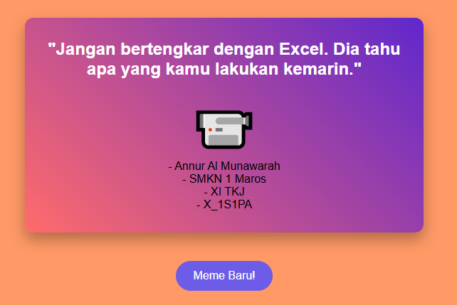

# 🤯 Meme Motivasi Absurd


## 📚 Daftar Isi
- [Deskripsi](#deskripsi)
- [Screenshot](#screenshot)
- [Fitur](#fitur)
- [Instalasi](#instalasi)
- [Penggunaan](#penggunaan)
- [Teknologi](#teknologi)
- [Kontributor](#kontributor)
- [Lisensi](#lisensi)

## 📝 Deskripsi
*Meme Motivasi Absurd* adalah aplikasi web sederhana yang menampilkan kutipan motivasi super absurd lengkap dengan emoji acak dan identitas personal. Cocok untuk hiburan ringan dan semangat yang tidak masuk akal tapi bikin senyum.

## 📸 Screenshot


## ✨ Fitur
- 🎲 Menampilkan kutipan motivasi absurd yang diacak
- 😎 Emoji unik dan random untuk setiap tampilan
- 🧾 Menampilkan identitas: nama, sekolah, jurusan, dan kelas
- 🔄 Tombol "Meme Baru!" untuk refresh kutipan secara instan

## 🛠️ Instalasi
```bash
# Clone repositori ini
git clone https://github.com/annuralmunawarah16/memeabsurd.git

# Masuk ke folder proyek
cd memeabsurd

# Jalankan aplikasi
node app.js

▶️ Penggunaan
	1.	Buka browser dan kunjungi http://localhost:3000
	2.	Lihat kutipan motivasi dan emoji absurd yang muncul
	3.	Klik tombol “Meme Baru!” untuk mendapatkan kutipan berikutnya

💻 Teknologi
	•	Node.js
	•	Express.js
	•	HTML5 + CSS3

👩‍💻 Kontributor
	•	Annur Al Munawarah – Developer

📄 Lisensi

Konten dalam file ini dilisensikan di bawah Creative Commons Attribution 4.0 International (CC BY 4.0).
Kode sumber proyek ini menggunakan MIT License.

⸻

Dibuat dengan ❤️ sebagai bagian dari semangat 1 Sekolah 1 Programmer